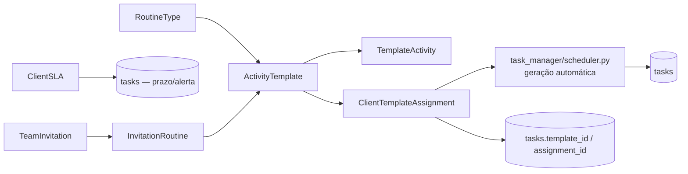
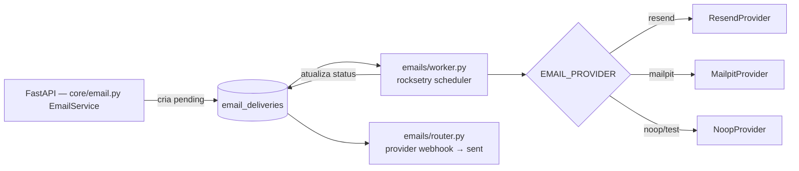
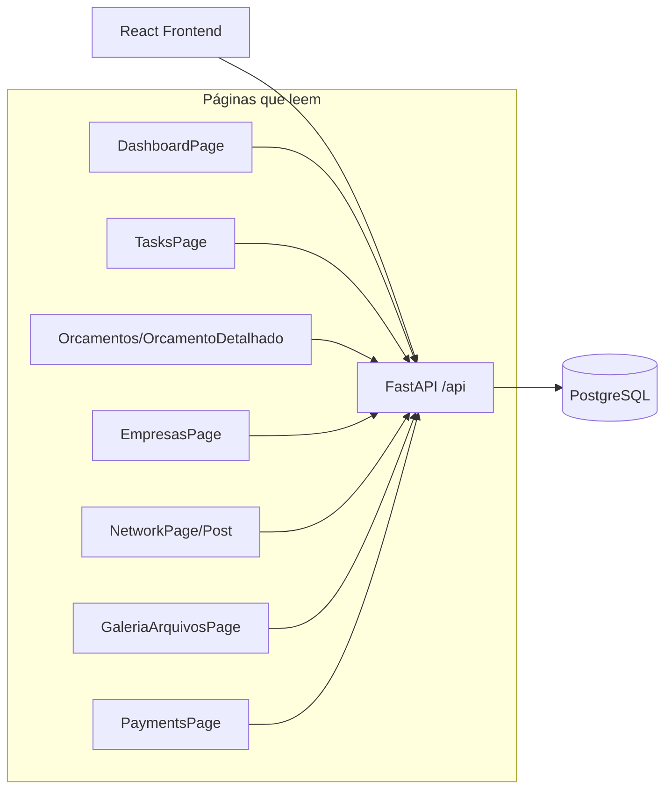

# Lineage do Banco de Dados — Café com BPO

> Documento de linhagem (data lineage) do banco de dados do Café com BPO.
> Reúne: tabelas, colunas, relacionamentos (FKs), quem consulta/escreve em cada
> tabela (backend + frontend), e diagramas Mermaid de navegação.

**Contexto técnico:** PostgreSQL 16 · SQLAlchemy 2.x (ORM declarative) · FastAPI ·
Alembic. Todos os modelos vivem em `apps/backend/src/modules/{modulo}/models.py`.
O `Base` de SQLAlchemy é definido em `apps/backend/src/core/database.py`.

**Snapshot do banco real (`docker compose exec db psql -U postgres -d cafe_bpo`):**
27 tabelas aplicadas, 44 foreign keys. 3 modelos **não migrados** (ver seção
"Tabelas de modelo sem tabela no banco").

---

## Sumário

| Módulo | Tabelas que possui (modelo) | Papel |
|--------|-----------------------------|-------|
| `auth` | `users` (inclui `asaas_customer_id`), `user_files`, `password_reset_tokens` | Identidade, perfil, senha, avatares |
| `clients` | `clients` | Portfólio de clientes do usuário ("Empresas") |
| `payments` | `payments` | Cobranças via Asaas |
| `proposals` | `pricing_scenarios` (dono ativo) | Orçamentos (calculadora) |
| `task_manager` | `tasks`, `task_phases`, `task_attachments`, `routine_types`, `activity_templates`, `template_activities`, `client_template_assignments`, `client_slas`, `user_template_archives` | Gestão de tarefas BPO (kanban, rotinas, SLA) |
| `team` | `teams`, `team_members`, `team_invitations`, `invitation_routines`, `roles` | Times/convites por cliente |
| `network` | `discussion_posts`, `discussion_comments` | Fórum da comunidade |
| `notifications` | `app_notifications` | Notificações in-app (sininho + feed do fórum) |
| `emails` | `email_deliveries` | Fila transacional de e-mails (worker) |
| `gallery` | `gallery_items`, `common_gallery_items` | Galeria de arquivos pessoal/comunitária |
| `calendar` | `user_google_tokens` ⚠️ não migrada | Tokens Google Calendar |
| `dashboard` | *(nenhum)* | Camada de agregação somente leitura |

---

## Diagramas Mermaid

### ERD principal (tabelas reais aplicadas no banco)

```mermaid
erDiagram
    users ||--o{ user_files : "user_id / avatar_file_id"
    users ||--o{ password_reset_tokens : "user_id"
    users ||--o{ clients : "user_id"
    users ||--o{ pricing_scenarios : "user_id"
    users ||--o{ tasks : "user_id"
    users ||--o{ routine_types : "user_id"
    users ||--o{ activity_templates : "user_id"
    users ||--o{ user_template_archives : "user_id"
    users ||--o{ client_slas : "user_id"
    users ||--o{ client_template_assignments : "user_id"
    users ||--o{ gallery_items : "user_id"
    users ||--o{ common_gallery_items : "created_by"
    users ||--o{ discussion_posts : "author_id"
    users ||--o{ discussion_comments : "author_id"
    users ||--o{ app_notifications : "user_id"
    users ||--o{ app_notifications : "triggered_by_user_id"
    users ||--o{ payments : "user_id"
    users ||--o{ teams : "owner_id"
    users ||--o{ team_members : "user_id"
    users ||--o{ team_invitations : "invited_by"

    clients ||--o{ teams : "client_id (1:1, unique)"
    clients ||--o{ pricing_scenarios : "client_id"
    clients ||--o{ tasks : "client_id"
    clients ||--o{ client_template_assignments : "client_id"
    clients ||--o{ client_slas : "client_id"

    teams ||--o{ team_members : "team_id"
    teams ||--o{ team_invitations : "team_id"
    roles ||--o{ team_members : "role_id"
    team_invitations ||--o{ invitation_routines : "invitation_id"

    activity_templates ||--o{ template_activities : "template_id"
    activity_templates ||--o{ client_template_assignments : "template_id"
    activity_templates ||--o{ invitation_routines : "template_id"
    activity_templates ||--o{ user_template_archives : "template_id"
    activity_templates }o--o{ routine_types : "routine_type_id (SET NULL)"
    task_phases ||--o{ tasks : "phase_id (SET NULL)"
    task_phases ||--o{ template_activities : "phase_id (SET NULL)"
    tasks ||--o{ task_attachments : "task_id"
    tasks }o--o{ activity_templates : "template_id (SET NULL)"
    tasks }o--o{ client_template_assignments : "assignment_id (SET NULL)"
    tasks }o--o{ users : "moved_by (SET NULL)"

    discussion_posts ||--o{ discussion_comments : "post_id"
```

### Linha do tempo (recorrência de rotinas → tarefas)

### Fluxo de e-mails transacionais (fila + worker)

### Fluxo de dados Frontend → API → Tabelas (visão macro)

---

## Tabela a tabela (dono, leitores, escritores)

Legenda: **R** = leitura (SELECT) · **W** = escrita (INSERT/UPDATE/DELETE, incl. soft-delete).

### `users` — dono: `auth`
| Direção | Quem | Onde |
|---------|------|------|
| R | `auth/repository.py`, `auth/service.py` | autenticação, perfil (`GET /auth/me`) |
| R | `team/repository.py` | lookups de dono/membro |
| R | `dashboard/router.py` | join para nomes de inviter/triggered_by |
| R | `auth/router.py` | profile/avatar endpoints |
| W | `auth/repository.py`, `auth/service.py` | register, update perfil, senha |
| W | `auth/router.py` | avatar_url, company_logo_url, nome |
| W ⚠️ | `payments/repository.py` | SQL raw `UPDATE users SET metadata = jsonb_set(...)` (`save_customer_id`) — **viola o módulo auth** |

### `user_files` — dono: `auth`
| Direção | Quem |
|---------|------|
| R/W | `auth/router.py` (upload avatar/logo cria registros e atualiza status) |
| R | via relação `user.avatar_file` |

### `password_reset_tokens` — dono: `auth`
| Direção | Quem |
|---------|------|
| R | `auth/service.py` (valida token no reset) |
| W | `auth/service.py` (cria token, marca `used=True`) |

### `clients` — dono: `clients`
| Direção | Quem |
|---------|------|
| R | `clients/repository.py`, `clients/router.py` |
| R | `team/repository.py` (`get_client_by_id`, `get_client_owner_id`) |
| R | `dashboard/service.py`, `dashboard/router.py` |
| W | `clients/repository.py`, `clients/router.py` (CRUD, soft-delete) |
| W ⚠️ | `clients/repository.py:delete()` — **cascade em massa**: marca `tasks` e `pricing_scenarios` como `is_active=False, deleted_at=now` |

### `teams` — dono: `team` (1:1 com `clients`)
| Direção | Quem |
|---------|------|
| R | `team/repository.py`, `clients/router.py` (`get_or_create_team`), `dashboard/router.py` |
| W | `team/repository.py` (`create_team`) |

### `team_members` — dono: `team`
| Direção | Quem |
|---------|------|
| R/W | `team/repository.py`, `team/router.py` |

### `team_invitations` — dono: `team`
| Direção | Quem |
|---------|------|
| R | `team/repository.py`, `team/router.py`, `dashboard/router.py` (convites pendentes) |
| W | `team/repository.py` (create/accept/reject/delete) |

### `invitation_routines` — dono: `team` (tabela associativa N:N)
| Direção | Quem |
|---------|------|
| R | `team/repository.py` (`get_routines_by_team`) |
| W | `team/repository.py` (`create_routine`) |

### `roles` — dono: `team`
| Direção | Quem |
|---------|------|
| R | `team/repository.py` |
| W | `team/repository.py` (`ensure_default_roles` — seed admin/member) |

### `pricing_scenarios` — dono: `proposals`
> Dono único. O modelo duplicado de `pricing/models.py` foi removido. O schema aplicado
> no banco é o do `proposals` (`client_name`, `input_payload`, `result_payload`,
> `client_id`, `is_active`, `deleted_at`).
| Direção | Quem |
|---------|------|
| R | `proposals/repository.py`, `dashboard/service.py`, `dashboard/router.py` |
| R/W | `proposals/router.py` (CRUD de orçamentos) |
| W | `clients/repository.py` (cascade soft-delete ao deletar cliente) |

### `tasks` — dono: `task_manager`
| Direção | Quem |
|---------|------|
| R | `task_manager/task/repository.py`, `dashboard/service.py`, `dashboard/router.py` |
| R | `task_manager/scheduler.py` (sondagem de recorrência) |
| R | `calendar/service.py` (sync para Google Agenda) |
| W | `task_manager/task/repository.py` + `task/service.py` (CRUD/kanban) |
| W | `task_manager/assignments/repository.py` (gera tarefas a partir de template) |
| W | `task_manager/scheduler.py` (cria tarefas de atribuições recorrentes) |
| W ⚠️ | `clients/repository.py` (cascade soft-delete ao deletar cliente) |

> **Migração `e4f1a2b3c4d5`**: coluna legada `status` (todo/doing/done) **removida**.
> Conclusão = `completed_at`; cancelamento = `is_cancelled`; estado do kanban = `phase_id`.

### `task_phases` — dono: `task_manager`
| Direção | Quem |
|---------|------|
| R/W | `task_manager/task/repository.py` (CRUD + reorder) |

> **Migração `7d7670c5f1cc`**: fases **globais canônicas** — coluna `user_id`
> **removida**. Existem exatamente 3 fases compartilhadas por todos os usuários:
> "a fazer" (0), "em andamento" (1), "concluido" (2, `is_done`). Criação/
> exclusão/reordenação bloqueadas na API; edição só nome/cor.

### `task_attachments` — dono: `task_manager`
| Direção | Quem |
|---------|------|
| R/W | `task_manager/attachments/repository.py` |

### `routine_types` — dono: `task_manager`
| Direção | Quem |
|---------|------|
| R/W | `task_manager/routine_types/repository.py` |

### `activity_templates` — dono: `task_manager`
| Direção | Quem |
|---------|------|
| R | `task_manager/templates/repository.py`, `task_manager/scheduler.py` |
| R | `team/repository.py` (`get_activity_templates_by_routine` — p/ convites) |
| R | `task_manager/routine_types/repository.py` (lookup no delete) |
| W | `task_manager/templates/repository.py` |

### `template_activities` — dono: `task_manager`
| Direção | Quem |
|---------|------|
| R/W | `task_manager/templates/repository.py` |

### `user_template_archives` — dono: `task_manager`
| Direção | Quem |
|---------|------|
| R/W | `task_manager/templates/repository.py` (`is_archived_for_user`, `set_archived_for_user`) |

### `client_template_assignments` — dono: `task_manager`
| Direção | Quem |
|---------|------|
| R | `task_manager/assignments/repository.py`, `task_manager/scheduler.py` |
| W | `task_manager/assignments/repository.py` (create/update/delete) |
| W | `task_manager/scheduler.py` (atualiza `last_generated_at`) |

### `client_slas` — dono: `task_manager`
| Direção | Quem |
|---------|------|
| R | `task_manager/sla/repository.py` |
| R | `task_manager/task/service.py` (cálculo de deadline/alerta) |
| W | `task_manager/sla/repository.py` |

### `app_notifications` — dono: `notifications`
> Sistema único de notificação in-app (sininho + feed de atividades do fórum).
> Tipos: `task_assigned`, `task_deadline`, `task_overdue`, `phase_change`, `post_commented`, `email_sent`.
| Direção | Quem |
|---------|------|
| R/W | `notifications/repository.py` (sininho: list, unread, count, read, delete) |
| R | `dashboard/router.py` (feed "Atividade Recente") |
| W | `network/repository.py` (dispatch `post_commented` via `NotificationDispatcher`) |

### `discussion_posts` / `discussion_comments` — dono: `network`
| Direção | Quem |
|---------|------|
| R/W | `network/repository.py` (posts, comentários, contadores) |
| R | `dashboard/router.py` (última atividade) |

### `email_deliveries` — dono: `emails` (fila + worker)
| Direção | Quem |
|---------|------|
| R | `emails/repository.py`, `emails/worker.py` (claim em lote), `emails/router.py` (webhook) |
| W | `emails/repository.py`, `emails/worker.py` (status/attempts) |
| W | `core/email.py` (`EmailService._enqueue` — **qualquer módulo** enfileira aqui) |
| W | `emails/router.py` (provider webhook → `sent`) |

### `gallery_items` / `common_gallery_items` — dono: `gallery`
| Direção | Quem |
|---------|------|
| R/W | `gallery/repository.py` (ambos) |

> **Migração `2c3f53fcef02`**: adicionada a coluna `public_id` em `gallery_items` e
> `common_gallery_items` (nullable). A galeria **comum** agora armazena o arquivo no
> Cloudinary (`resource_type="raw"`) — o banco guarda os metadados (`file_path` = URL do
> Cloudinary, `public_id` = ID do Cloudinary p/ exclusão). A galeria do usuário segue em
> disco local (`storage/gallery/`).
>
> **Migração `3e5a1b2c9d4f`**: coluna `file_type` ampliada de `VARCHAR(50)` para
> `VARCHAR(255)` em `gallery_items` e `common_gallery_items` — MIME types longos
> (ex.: `.docx` = `application/vnd.openxmlformats-officedocument.wordprocessingml.document`)
> estouravam o limite de 50 e causavam `DataError` (500) no upload.

### `payments` — dono: `payments`
| Direção | Quem |
|---------|------|
| R | `payments/repository.py` (get_by_user, get_by_id) |
| W | `payments/repository.py` (create, update status) + `users.asaas_customer_id` via ORM em `auth/models.py` |

### `user_google_tokens` — dono: `calendar` ⚠️ **não migrada no banco**
| Direção | Quem |
|---------|------|
| R/W | `calendar/repository.py`, `calendar/service.py` |

---

## Quem consulta o quê — camada Backend (por módulo)

| Módulo | Tabelas acessadas | Arquivos |
|--------|-------------------|----------|
| `auth` | users, user_files, password_reset_tokens | `repository.py`, `service.py`, `router.py` |
| `clients` | clients, teams (get_or_create), tasks (cascade), pricing_scenarios (cascade) | `repository.py`, `router.py` |
| `proposals` | pricing_scenarios | `repository.py`, `router.py`, `service.py` |
| `task_manager` | tasks, task_phases, task_attachments, routine_types, activity_templates, template_activities, client_template_assignments, client_slas | `task/repository.py`, `templates/repository.py`, `assignments/repository.py`, `sla/repository.py`, `routine_types/repository.py`, `attachments/repository.py`, `scheduler.py` |
| `team` | teams, team_members, team_invitations, invitation_routines, roles, activity_templates, clients, users | `repository.py`, `router.py` |
| `network` | discussion_posts, discussion_comments, users | `repository.py`, `router.py` |
| `notifications` | app_notifications | `repository.py`, `router.py` |
| `emails` | email_deliveries | `repository.py`, `router.py`, `worker.py`, `scheduler.py` |
| `gallery` | gallery_items, common_gallery_items | `repository.py`, `router.py` |
| `payments` | payments, users (asaas_customer_id via ORM) | `repository.py`, `router.py` |
| `calendar` | user_google_tokens, tasks (sync) | `repository.py`, `service.py` |
| `dashboard` | users, clients, pricing_scenarios, tasks, teams, team_invitations, app_notifications | `service.py`, `router.py` (**somente leitura**) |
| `feedback` | *(nenhum)* — apenas `EmailService` | `service.py`, `router.py` |
| `core` | email_deliveries (enfileira) | `email.py` |

### Workers/schedulers (acesso direto ao banco, fora de routers)
- `task_manager/scheduler.py` — gera tarefas a partir de `client_template_assignments` + `activity_templates` (recorrência daily/weekly/monthly/yearly), atualiza `last_generated_at`.
- `emails/scheduler.py` + `emails/worker.py` — processa `email_deliveries` (claim, envio via provider, atualização de status).
- `core/email.py` — enfileira `email_deliveries` com idempotência.
- `calendar/service.py` — lê tokens e sincroniza `tasks`.

### Real-time (SSE + PostgreSQL LISTEN/NOTIFY)
- **Triggers task_updates**: `trg_notify_task_update` na tabela `tasks` — dispara `pg_notify('task_updates', payload)` quando `phase_id` muda.
- **Triggers team_updates**:
  - `trg_notify_invitation_routines` em `invitation_routines` — INSERT/DELETE (rotina adicionada/removida)
  - `trg_notify_team_members` em `team_members` — UPDATE is_active (membro adicionado/removido)
  - `trg_notify_team_invitations` em `team_invitations` — UPDATE status (convite aceito/declinado)
- **Listener**: `task_manager/broadcast.py` → `BroadcastManager._listen()` conecta via psycopg em 2 canais (`task_updates`, `team_updates`) e distribui eventos para filas `asyncio.Queue` dos clientes SSE.
- **Endpoint**: `GET /tasks/events` (StreamingResponse) — clientes abrem conexão SSE e recebem eventos.
- **Frontend**: `useTaskEvents()` hook → `EventSource` conecta ao endpoint → invalida cache `['tasks']` ao receber evento → boards atualizam automaticamente.

---

## Quem consulta o quê — camada Frontend

### Hooks por grupo de API

| Grupo API | Camada de acesso | Consumidores |
|-----------|------------------|--------------|
| `/auth/*` | `api/client.ts`, `context/AuthContext.tsx`, `api/clients.ts` (profile/avatar/logo) | LoginForm, RegisterForm, RegisterModal, ProtectedRoute, PanelSidebar, PanelNavbar, PerfilPage, ForgotPassword, ResetPassword, OAuthCallback, InvitationAccept |
| `/clients/*` | `api/clients.ts`, `api/hooks/useTasks.ts` (useUpdateClient) | EmpresasPage (CRUD), OrcamentoDetalhadoPage, TasksPage, TaskModal, ClientTimelinePage |
| `/proposals/*` | chamadas diretas a `apiClient` | OrcamentosPage (R/W), OrcamentoNovoPage (R/W), OrcamentoDetalhadoPage (R + send-email), DashboardPage (R/W legado), AuthContext (sync sessão) |
| `/pricing/calculate` | `api/hooks/usePricing.ts` | **não consumido** — calculadora usa `lib/pricingEngine.ts` local |
| `/tasks/*`, `/templates/*`, `/routines/*` | `api/hooks/useTasks.ts` (hub central) | TasksPage, TemplateListPage, TemplateDetailPage, EmpresasPage (assignments), ClientTimelinePage |
| `/team/*` | `api/team.ts` (funções, sem hook) | EmpresasPage (invite/remove/resend), PendingInvitationCard (accept/decline), LoginForm/RegisterForm (invite_token), InvitationAcceptPage |
| `/payments/*` | direto no `apiClient` | PaymentsPage |
| `/notifications/*` | `api/hooks/useAppNotifications.ts` | NotificationBell (PanelLayout + NetworkPage), DashboardPage (marca atividade como lida) |
| `/network/posts` | `api/network.ts` | NetworkPage (R/W posts), NetworkPostPage (R/W comentários) |
| `/gallery/*` | direto no `apiClient` | GaleriaArquivosPage |
| `/dashboard/*` | `api/hooks/useDashboard.ts` | DashboardPage (summary), invalida cache após aceitar convite |
| `/calendar/sync` | `api/hooks/useTasks.ts` | TasksPage (botão Google Agenda) |
| `/feedback/*` | `api/hooks/useFeedback.ts` | ModalReportarErro (sidebar) |

### Mapa Página → Rotas → APIs

| Página | Rota | APIs (R / W) |
|--------|------|--------------|
| DashboardPage (painel) | `/painel` | R `GET /dashboard/summary` · W `PUT /tasks/{id}`, `PUT /notifications/{id}/read` |
| OrcamentosPage | `/painel/orcamentos` | R `GET /proposals/` · W `DELETE /proposals/{id}` |
| OrcamentoNovoPage | `/painel/novo-orcamento`, `/painel/editar-orcamento/:id` | R `GET /proposals/{id}` · W `POST/PUT /proposals/` |
| OrcamentoDetalhadoPage | `/painel/orcamento/:id` | R `GET /proposals/{id}`, `GET /clients/` · W `POST /proposals/{id}/send-email` |
| PerfilPage | `/painel/perfil` | W `PATCH /auth/me`, `POST /auth/me/avatar`, `POST /auth/me/company-logo` |
| EmpresasPage | `/painel/empresas` | R `GET /clients/`, `GET /clients/{id}/team`, `GET /clients/{id}/invitations`, `GET /tasks/client-templates/` · W `POST/PUT/DELETE /clients/`, `POST /clients/{id}/invite`, `DELETE /clients/{id}/team/{userId}`, `POST /clients/{id}/invitations/{id}/resend`, `POST/DELETE /tasks/client-templates/`, `POST /auth/users/lookup` |
| TasksPage | `/painel/tarefas` | R `GET /tasks/`, `GET /tasks/phases/`, `GET /clients/`, `GET /tasks/templates/` · W `PUT /tasks/{id}`, `POST /tasks/{id}/cancel`, `POST /tasks/phases/reorder`, `POST /tasks/scheduler/run-*`, `POST /calendar/sync` |
| TemplateListPage | `/painel/templates-atividades` | CRUD `/tasks/templates/`, `/tasks/routine-types/` |
| TemplateDetailPage | `/painel/templates-atividades/:id` | CRUD atividades, SLAs, assignments |
| ClientTimelinePage | `/painel/timeline/:clientId` | R `GET /tasks/client-timeline/{id}`, `GET /clients/` |
| PaymentsPage | `/painel/pagamentos` | R `GET /payments/` · W `POST /payments/create` |
| NetworkPage | `/painel/forum` | R `GET /network/posts` · W `POST /network/posts` |
| NetworkPostPage | `/painel/forum/:id` | R `GET /network/posts/{id}`, `GET /comments` · W `POST comments`, `DELETE post` |
| GaleriaArquivosPage | `/painel/galeria` | R `GET /gallery/`, `GET /gallery/common` · W uploads/deletes (comum só admin) |
| DesignSystemPage | `/painel/design-system` (admin) | nenhuma |

### Rotas públicas (sem painel)
| Página | Rota | APIs |
|--------|------|------|
| HomePage | `/` | nenhuma |
| Login/Cadastro/OAuth | `/login`, `/cadastro`, `/auth/callback` | `/auth/*` |
| SimulatorPage | `/simulador` | nenhuma (engine local + sessionStorage) |
| ProposalPreviewPage | `/proposta` | nenhuma (sessionStorage `cafe_bpo_proposal`) |
| InvitationAcceptPage | `/invitations/accept` | R `GET /invitations/accept?token=` |
| Forgot/Reset | `/esqueci-minha-senha`, `/redefinir-senha` | W `/auth/forgot-password`, `/auth/reset-password` |

---

## Tabelas de modelo sem tabela no banco (migrações pendentes/órfãs)

O banco aplicado está em `276b8d51e2d9` (head atual do Alembic). A tabela abaixo
**existe no modelo mas NÃO existe no PostgreSQL** — sua migração é órfã
(`down_revision` não pertence à cadeia principal):

| Tabela | Módulo | Migração | Observação |
|--------|--------|----------|------------|
| `user_google_tokens` | calendar | `355dc46a3695_add_user_google_tokens_table` | Tokens Google Calendar. Router registrado (`/calendar/sync`), tabela ausente. |

> ⚠️ Impacto: qualquer chamada a `/calendar/sync` retorna erro de "relation does not exist"
> até que essa migração seja integrada à cadeia do head.

---

## Notas de integridade e riscos

1. **`pricing_scenarios` com um único dono ORM** — `proposals/models.py` (ativo).
   O modelo duplicado em `pricing/models.py` foi removido.
2. **`users.asaas_customer_id`** — `payments/repository.py` grava o customer do Asaas
   via ORM no campo `asaas_customer_id` de `auth/models.py` (sem SQL raw).
3. **Cascade de soft-delete em `clients`** — deletar um cliente desativa em cascata
   `tasks` e `pricing_scenarios` (mantém histórico com `deleted_at`). O frontend
   apresenta como "arquivar" (soft delete), não exclusão permanente.
4. **Sistema único de notificação** — `app_notifications` é a única fonte de verdade
   (sininho + feed de atividades). A tabela `notifications` (network) foi removida e
   seus dados migrados para `app_notifications` com `related_entity_type/related_entity_id`
   (`discussion_post`) e `triggered_by_user_id`.
5. **Workers acessam o banco fora da API** — scheduler de tarefas e worker de e-mail
   usam `SessionLocal()` diretamente (rocketry), não passam por routers.
6. **`email_deliveries` é a única fila** — todos os e-mails transacionais (reset de senha,
   convite, proposta, entrega de tarefa, custom) passam por ela.
